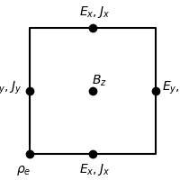
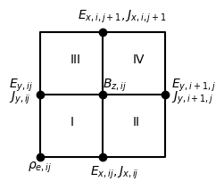
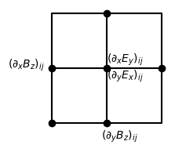

2D electromagnetic PIC simulation.
# Yee lattice
The Yee lattice is assigned as below.



# Detailed equations of PIC
The distribution function of a macro-particle is

$$f_p(t,\vec{x},\vec{p})=N_pS(\vec{x}-\vec{x}_p)\delta(\vec{p}-\vec{p}_p)$$

Put it into Vlasov equation, we get

$$\frac{d\vec{x}_p}{dt}=\vec{v}_p,~~\frac{d\vec{p}_p}{dt}=q\left(\vec{E}_p+\frac{\vec{v}_p\times\vec{B}_p}{c}\right)$$

$$\vec{E}_p=\int d^3\vec{E}(\vec{x})S(\vec{x}-\vec{x}_p),~~\vec{B}_p=\int d^3\vec{B}(\vec{x})S(\vec{x}-\vec{x}_p)$$

$S(\vec{x}-\vec{x}_p)$ is the shape function. We use cloud-in-cell(CIC) shape function, that is

```math
S(\vec{x}-\vec{x}_p)=1/dxdydx~~~{\rm if} |x-x_p|\leq dx/2~{\rm and}~|y-y_p|\leq dy/2~{\rm and}~|z-z_p|\leq dz/2
```

$$\int d^3xS(\vec{x}-\vec{x}_p)=1$$

Weught function is 

$$W(\vec{x}_ c-\vec{x}_ p)=\int_ {\vec{x}_c-d\vec{x}/2}^{\vec{x}_c+d\vec{x}/2}S(\vec{x}-\vec{x}_p)d^3x$$

$$\vec{E}_ p=\sum_{\vec{x}_ c}\vec{E}(\vec{x}_ c)W(\vec{x}_ c-\vec{x}_ p),~~\vec{B}_ p=\sum_{\vec{x}_ c}\vec{B}(\vec{x}_ c)W(\vec{x}_ c-\vec{x}_ p)$$

For CIC shape function,

$$W(\Delta)=1-|\Delta|~~{\rm if}~|\Delta|<1,~~\Delta=\frac{x_p-x_c}{dx}$$

# Procedure
0: Initial: $`\vec{x}^0,\vec{v}^0,\vec{E}^0=0,\vec{B}^0=0`$

1: Initialization: $`\vec{v}^{-1/2},\vec{B}^{1/2}~~~\Rightarrow~~~x^0,v^{-1/2},E^0,B^0,B^{1/2}`$

2: n-th time step: We have $`x^n,x^{n-1},v^{n-1/2},E^n,B^n,B^{n+1/2},J^{n-1/2}`$, 

$$E^n,B^n\Rightarrow a^n\Rightarrow v^{n+1/2}\Rightarrow x^{n+1}\rightarrow[x^n,x^{n+1},v^{n+1/2},E^n,B^n,B^{n+1/2},J^{n-1/2}]$$ (Boris push or Vay push. Done.)

$$x^n,x^{n+1},v^{n+1/2}\Rightarrow J^{n+1/2}\rightarrow [x^n,x^{n+1},v^{n+1/2},E^n,B^n,B^{n+1/2},J^{n+1/2}]$$ (zigzag method. Done.)

$$J^{n+1/2},B^{n+1/2}\Rightarrow E^{n+1}\Rightarrow B^{n+3/2},B^{n+1}\rightarrow [x^n,x^{n+1},v^{n+1/2},E^{n+1},B^{n+1},B^{n+3/2},J^{n+1/2}]$$(Solve Maxwell equations. Doing)

## Charge conserved method
```math
\begin{equation}
\begin{aligned}
{\rm Loop}&p:\\
~~~&i_p^1={\rm int}\left(\frac{x_p^1-x_0}{dx}\right),~j_p^1={\rm int}\left(\frac{y_p^1-y_0}{dy}\right)\\
~~~&i_p^2={\rm int}\left(\frac{x_p^2-x_0}{dx}\right),~j_p^2={\rm int}\left(\frac{y_p^2-y_0}{dy}\right)\\
~~~&{\rm if}(i_p^2==i_p^1) [x_r=(x_1+x_2)/2];else[x_r=max(i_p^1dx,i_p^2dx)]\\
~~~&{\rm if}(j_p^2==j_p^1) [y_r=(y_1+y_2)/2];else[y_r=max(j_p^1dy,j_p^2dy)]\\
~~~&F_x^1=q(x_r-x_1)/dt,~F_y^1=q(y_r-y_1)/dt,~F_x^2=q(x_2-x_r)/dt,~F_y^2=q(y_2-y_r)/dt\\
~~~&W_x^1=\frac{x_r+x_1}{2dx}-i_p^1,~W_y^1=\frac{y_r+y_1}{2dy}-j_p^1,~W_x^2=\frac{x_r+x_2}{2dx}-i_p^2,~W_y^2=\frac{y_r+y_2}{2dy}-j_p^2\\
~~~&J_x(i_1+1/2,j_1)+=\frac{F_x^1(1-W_y^1)}{dxdy},~~~J_x(i_1+1/2,j_1+1)+=\frac{F_x^1W_y^1}{dxdy}\\
~~~&J_y(i_1,j_1+1/2)+=\frac{F_y^1(1-W_x^1)}{dxdy},~~~J_y(i_1+1,j_1+1/2)+=\frac{F_y^1W_x^1}{dxdy}\\
~~~&J_x(i_2+1/2,j_2)+=\frac{F_x^2(1-W_y^2)}{dxdy},~~~J_x(i_2+1/2,j_2+1)+=\frac{F_x^2W_y^2}{dxdy}\\
~~~&J_y(i_2,j_2+1/2)+=\frac{F_y^2(1-W_x^2)}{dxdy},~~~J_y(i_2+1,j_2+1/2)+=\frac{F_y^2W_x^2}{dxdy}\\
\end{aligned}
\end{equation}
```

# Interpolation on Yee grid
The Yee lattice is assigned as below.




$$f_x=\frac{x_p-x_i}{dx},~~f_y=\frac{y_p-y_j}{dy}$$

```math
\begin{equation}
\begin{aligned}
{\rm I:~}&Ex:~i,i-1;j,j+1;~~~\Delta_x=f_x+0.5,&\Delta_y=f_y\\
&Ey:~i,i+1;j,j-1;~~~\Delta_x=f_x,&\Delta_y=f_y+0.5\\
&Bz:~i,i-1;j,j-1;~~~\Delta_x=f_x+0.5,&\Delta_y=f_y+0.5\\
&-------------&------\\
{\rm II:~}&Ex:~i,i+1;j,j+1;~~~\Delta_x=f_x-0.5,&\Delta_y=f_y\\
&Ey:~i,i+1;j,j-1;~~~\Delta_x=f_x,&\Delta_y=f_y+0.5\\
&Bz:~i,i+1;j,j-1;~~~\Delta_x=f_x-0.5,&\Delta_y=f_y+0.5\\
&-------------&------\\
{\rm III:~}&Ex:~i,i-1;j,j+1;~~~\Delta_x=f_x+0.5,&\Delta_y=f_y\\
&Ey:~i,i+1;j,j+1;~~~\Delta_x=f_x,&\Delta_y=f_y-0.5\\
&Bz:~i,i-1;j,j+1;~~~\Delta_x=f_x+0.5,&\Delta_y=f_y-0.5\\
&-------------&------\\
{\rm IV:~}&Ex:~i,i+1;j,j+1;~~~\Delta_x=f_x-0.5,&\Delta_y=f_y\\
&Ey:~i,i+1;j,j+1;~~~\Delta_x=f_x,&\Delta_y=f_y-0.5\\
&Bz:~i,i+1;j,j+1;~~~\Delta_x=f_x-0.5,&\Delta_y=f_y-0.5\\
\end{aligned}
\end{equation}
```

# Curl of field

$$\frac{\partial\vec{B}}{\partial t}=-c\nabla\times\vec{E},~~~\frac{\partial\vec{E}}{\partial t}=c\nabla\times\vec{B}-4\pi\vec{J}$$

```math
\begin{equation}
\begin{matrix}
\frac{\partial B_z}{\partial t}=c(\partial_yE_x-\partial_xE_y)\\
\frac{\partial E_x}{\partial t}=c\partial_yB_z-4\pi J_x\\
\frac{\partial E_y}{\partial t}=-c\partial_xB_z-4\pi J_y
\end{matrix}\Rightarrow
\begin{matrix}
\frac{\partial B_z}{\partial t}|^{n+1}_{i+1/2,j+1/2}=c(\partial_yE_x-\partial_xE_y)|^{n+1}_{i+1/2,j+1/2}\\
\frac{\partial E_x}{\partial t}|^{n+1/2}_{i+1/2,j}=c\partial_yB_z|^{n+1/2}_{i+1/2,j}-4\pi J_x|^{n+1/2}_{i+1/2,j}\\
\frac{\partial E_y}{\partial t}|^{n+1/2}_{i,j+1/2}=-c\partial_xB_z|^{n+1/2}_{i,j+1/2}-4\pi J_y|^{n+1/2}_{i,j+1/2}
\end{matrix}
\end{equation}
```

$$E_ x|^{n+1}_ {ij}=E_ x|^n_ {ij}+(c\partial_ yB_ z-4\pi J_ x)|^{n+1/2}_ {ij}dt$$

$$E_ y|^{n+1}_ {ij}=E_ y|^n_ {ij}+(-c\partial_ xB_ z-4\pi J_ y)|^{n+1/2}_ {ij}dt$$

$$B_ z|^{n+3/2}_ {ij}=B_ z|^{n+1/2}_ {ij}+c(\partial_ yE_ x-\partial_ xE_ y)|^{n+1}_ {ij}dt$$

$$E_ x|^{n+1}_ {ij}=E_ x|^n_ {ij}+\left(c\frac{B_ z|^{n+1/2}_ {ij}-B_ z|^{n+1/2}_ {i,j-1}}{dy}-4\pi J_ x|^{n+1/2}_ {ij}\right)dt$$

$$E_ y|^{n+1}_ {ij}=E_ y|^n_ {ij}+\left(-c\frac{B_ z|^{n+1/2}_ {ij}-B_ z|^{n+1/2}_ {i-1,j}}{dx}-4\pi J_ y|^{n+1/2}_ {ij}\right)dt$$

$$B_ z|^{n+3/2}_ {ij}=B_ z|^{n+1/2}_ {ij}+c\left(\frac{E_x|^{n+1}_ {i,j+1}-E_x|^{n+1}_ {i,j}}{dy}-\frac{E_y|^{n+1}_ {i+1,j}-E_y|^{n+1}_ {i,j}}{dx}\right)dt$$

# Vay pusher algorithm
We want to calculate $`\vec{v}^{i+1/2}`$ from $`\vec{v}^{i-1/2},\vec{E}^i,\vec{B}^i`$.

```math
\begin{equation}
\begin{aligned}
&1.~~A=\frac{qdt}{2m},~~\gamma^{i-1/2}=\frac{1}{\sqrt{1-(v^{i-1/2})^2/c^2}},~~\vec{u}^{i-1/2}=\gamma^{i-1/2}\vec{v}^{i-1/2}\\
&2.~~\vec{u}^i=\vec{u}^{i-1/2}+A(\vec{E}^i+\vec{v}^{i-1/2}\times\vec{B}^i)\\
&3.~~\vec{u}'=\vec{u}^i+A\vec{E}^i~~~~~~\Rightarrow~~~~~~\vec{u}^{i+1/2}=\vec{u}'+A\frac{\vec{u}^{i+1/2}}{\gamma^{i+1/2}}\times\vec{B}^i\\
&4.~~\gamma'=\sqrt{1+u'^2/c^2},\vec{\tau}=A\vec{B}^i,u^*=\vec{u}'\cdot\vec{\tau}/c,\sigma=\gamma'^2-\tau^2\\
&5.~~\gamma^{i+1/2}=\sqrt{\frac{\sigma+\sqrt{\sigma^2+4(\tau^2+u^{*2})}}{2}},\vec{t}=\frac{\vec{\tau}}{\gamma^{i+1/2}},s=\frac{1}{1+t^2}\\
&6.~~\vec{u}^{i+1/2}=s[\vec{u}'+(\vec{u}'\cdot\vec{t})\vec{t}+\vec{u}'\times\vec{t}]\\
&7.~~\vec{v}^{i+1/2}=\vec{u}^{i+1/2}/\gamma^{i+1/2}
\end{aligned}
\end{equation}
```


