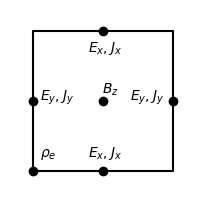

2D electromagnetic PIC simulation.
# Yee lattice
The Yee lattice is assigned as below.



# Detailed equations of PIC
The distribution function of a macro-particle is

$$f_p(t,\vec{x},\vec{p})=N_pS(\vec{x}-\vec{x}_p)\delta(\vec{p}-\vec{p}_p)$$

Put it into Vlasov equation, we get

$$\frac{d\vec{x}_p}{dt}=\vec{v}_p,~~\frac{d\vec{p}_p}{dt}=q\left(\vec{E}_p+\frac{\vec{v}_p\times\vec{B}_p}{c}\right)$$

$$\vec{E}_p=\int d^3\vec{E}(\vec{x})S(\vec{x}-\vec{x}_p),~~\vec{B}_p=\int d^3\vec{B}(\vec{x})S(\vec{x}-\vec{x}_p)$$

$S(\vec{x}-\vec{x}_p)$ is the shape function. We use cloud-in-cell(CIC) shape function, that is

```math
S(\vec{x}-\vec{x}_p)=1/dxdydx~~~{\rm if} |x-x_p|\leq dx/2~{\rm and}~|y-y_p|\leq dy/2~{\rm and}~|z-z_p|\leq dz/2
```

$$\int d^3xS(\vec{x}-\vec{x}_p)=1$$

Weught function is 

$$W(\vec{x}_ c-\vec{x}_ p)=\int_ {\vec{x}_c-d\vec{x}/2}^{\vec{x}_c+d\vec{x}/2}S(\vec{x}-\vec{x}_p)d^3x$$

$$\vec{E}_ p=\sum_{\vec{x}_ c}\vec{E}(\vec{x}_ c)W(\vec{x}_ c-\vec{x}_ p),~~\vec{B}_ p=\sum_{\vec{x}_ c}\vec{B}(\vec{x}_ c)W(\vec{x}_ c-\vec{x}_ p)$$

For CIC shape function,

$$W(\Delta)=1-|\Delta|~~{\rm if}~|\Delta|<1,~~\Delta=\frac{x_p-x_c}{dx}$$

# Procedure
1：$`\vec{v}_ p^{n-1/2} \Rightarrow \vec{v}_ p^{n+1/2}`$ using Boris push in nonrelativistic case and Vay push in relativistic case.

2：$`\vec{x}_ p^ {n+1}=\vec{x}_ p^ {n} + \vec{v}_ p^ {n+1/2}dt`$.

3: Use $`\vec{x}_p^{n},\vec{x}_p^{n+1},\vec{v}_p^{n+1/2}`$ calculate $\vec{J}_c^{n+1/2}$

4: Solve Maxwell equations;

5: Gather.

## Charge conserved method
```math
\begin{equation}
\begin{aligned}
{\rm Loop}&p:\\
~~~&i_p^1={\rm int}\left(\frac{x_p^1-x_0}{dx}\right),~j_p^1={\rm int}\left(\frac{y_p^1-y_0}{dy}\right)\\
~~~&i_p^2={\rm int}\left(\frac{x_p^2-x_0}{dx}\right),~j_p^2={\rm int}\left(\frac{y_p^2-y_0}{dy}\right)\\
~~~&{\rm if}(i_p^2==i_p^1) [x_r=(x_1+x_2)/2];else[x_r=max(i_p^1dx,i_p^2dx)]\\
~~~&{\rm if}(j_p^2==j_p^1) [y_r=(y_1+y_2)/2];else[y_r=max(j_p^1dy,j_p^2dy)]\\
~~~&F_x^1=q(x_r-x_1)/dt,~F_y^1=q(y_r-y_1)/dt,~F_x^2=q(x_2-x_r)/dt,~F_y^2=q(y_2-y_r)/dt\\
~~~&W_x^1=\frac{x_r+x_1}{2dx}-i_p^1,~W_y^1=\frac{y_r+y_1}{2dy}-j_p^1,~W_x^2=\frac{x_r+x_2}{2dx}-i_p^2,~W_y^2=\frac{y_r+y_2}{2dy}-j_p^2\\
~~~&J_x(i_1+1/2,j_1)+=\frac{F_x^1(1-W_y^1)}{dxdy},~~~J_x(i_1+1/2,j_1+1)+=\frac{F_x^1W_y^1}{dxdy}\\
~~~&J_y(i_1,j_1+1/2)+=\frac{F_y^1(1-W_x^1)}{dxdy},~~~J_y(i_1+1,j_1+1/2)+=\frac{F_y^1W_x^1}{dxdy}\\
~~~&J_x(i_2+1/2,j_2)+=\frac{F_x^2(1-W_y^2)}{dxdy},~~~J_x(i_2+1/2,j_2+1)+=\frac{F_x^2W_y^2}{dxdy}\\
~~~&J_y(i_2,j_2+1/2)+=\frac{F_y^2(1-W_x^2)}{dxdy},~~~J_y(i_2+1,j_2+1/2)+=\frac{F_y^2W_x^2}{dxdy}\\
\end{aligned}
\end{equation}
```


